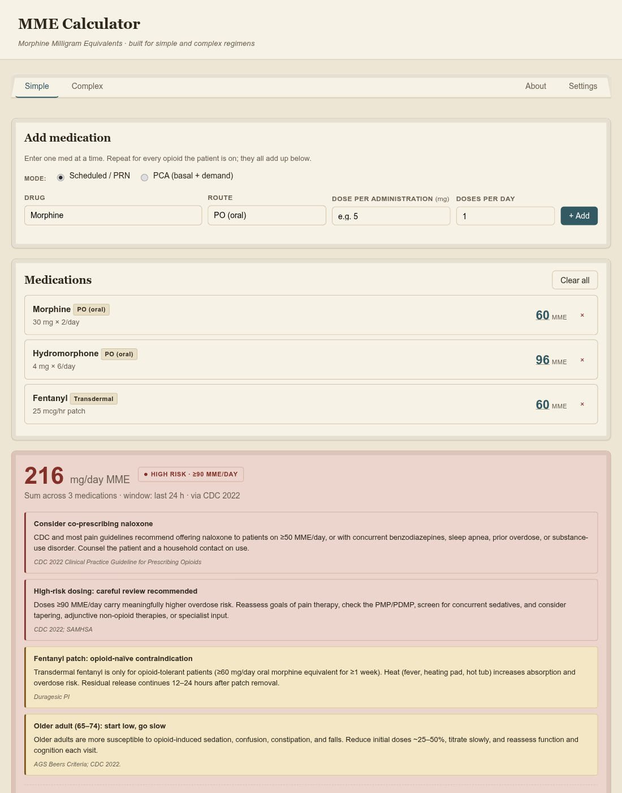

# MME Calculator

A single-page opioid Morphine Milligram Equivalent (MME) calculator. Total a
patient's daily MME from any mix of home medications, inpatient PRNs, IV
drips, PCAs, and pasted EHR administration records, then convert that total
to an equivalent dose of a different opioid with suggested scheduled and
breakthrough orders, safety alerts, a before/after comparison, and a taper
schedule.

Runs entirely in the browser. No backend. No build step. No data leaves the
device. Works as a regular website and as an installable PWA you can use
offline.



**Live version:** <https://robbie-med.github.io/Mme/>

---

## Who this is for

Clinicians (pain medicine, palliative care, anesthesia, hospital medicine,
primary care, addiction medicine) who need a fast, transparent scratch-pad
for opioid math at the point of care:

- "What's this patient's MME / day?"
- "I need to switch from morphine PO to hydromorphone PO, what dose?"
- "Help me write the actual order: scheduled plus breakthrough."
- "Plan a taper down to ≤50% of current."
- "What's my safety risk at this dose, and should I be co-prescribing naloxone?"

---

## Quick start

1. Open the app (or install it as a PWA).
2. **Simple view:** pick a drug, route, dose, doses-per-day → **+ Add**.
3. Repeat for every opioid the patient is on.
4. Read the running **MME / day** total and any safety alerts.
5. (Optional) Pick a **target opioid** plus cross-tolerance reduction to get
   an equivalent dose, finishable scheduled and breakthrough orders, a
   before/after comparison, and a taper plan.

For complex cases (inpatient PRNs, IV drips, parsed MAR data, patient
context), switch to **Complex view**.

---

## Features

### Two main views plus Settings

- **Simple:** streamlined cards for the everyday case. Add a med, see MME,
  convert if you want. No clutter.
- **Complex:** paste-MAR box, Patient Context panel, time-window controls
  (last 24 / 48 / 72 h or all-normalized-to-24h), the full breakdown table
  with calculation columns, and a references panel.
- **Settings:** default view on launch, persistence toggle, equianalgesic
  table picker (CDC 2022 / GlobalRPh / ASCO), install button, live
  online/offline cache status, and a confirm-gated Reset.

### Adding medications

- **Quick-add form** with smart unit hints. Fentanyl flips to mcg, the
  transdermal field becomes Patch rate (mcg/hr), methadone surfaces its
  tiered-factor note.
- **PCA mode:** toggle the Add form into a PCA layout for basal rate,
  demand dose, lockout, and avg demands/day. Effective daily dose is
  computed and contributes to the same MME total.
- **Paste MAR** (Complex view): drop in raw EHR text. The parser handles
  drug headers, brand names, tall-man lettering, multi-order blocks
  (`or`-prefixed and unprefixed strength changes), free-text PRN comments,
  and date / time / dose triplets.

### MME totals & risk awareness

- **Headline MME / day** updates live as you add or remove entries.
- **CDC tiered risk badge:** Below threshold (<50), Caution (≥50), High
  risk (≥90), with the totals card tinted to match.
- **Safety alerts** below the total: naloxone co-prescription prompt,
  high-risk review prompt, methadone-specific cautions (QTc, steady state,
  specialist), meperidine Beers Criteria, tramadol/codeine CYP2D6, fentanyl
  patch opioid-naïve contraindication. Each carries a citation pointer.
- **Patient context amplifications:** age band, renal CrCl band, and
  hepatic Child-Pugh band trigger additional alerts (elderly + meperidine
  → Beers severe; CKD + morphine → M3G/M6G accumulation; severe hepatic +
  tramadol → avoid). Context never affects MME math.

### Conversion to a target opioid

- Pick a target (PO / IV / IM / SC / transdermal / chronic PO methadone)
  and a cross-tolerance reduction (0 / 25 / 33 / 50%).
- Equivalent dose with an explicit calculation breakdown.
- **Suggested orders**:
  - Scheduled: ER BID + IR q4h alternative for PO drugs with ER; q4h
    scheduled for IR-only; TID for chronic methadone; nearest fentanyl
    patch size rounded down; continuous mcg/hr for fentanyl IV.
  - Breakthrough: 10–20% of new daily, q4h PRN, rounded to clinically
    reasonable increments (2.5 mg for oxycodone, 0.5 mg for
    hydromorphone, 5 mg for morphine, etc.).
  - Notes: steady-state and ECG for methadone, opioid-tolerance + heat
    hazard for fentanyl patch, chest-wall rigidity for fentanyl IV.
- **Before/after comparison:** two-column current-vs-proposed view with
  each side's total and risk-tier badge plus a Δ from current. **Apply
  this regimen** swaps the ledger to the proposed primary entry in one
  click.
- **Taper-schedule generator:** stepwise reduction from the proposed
  regimen. Configurable reduction-per-step (10/15/25/50%), interval
  (weekly / fortnightly / monthly), and endpoint (≤50% of starting MME /
  ≤25% / stop). Each row shows the per-drug dose, MME, % of start, and
  the CDC risk tier crossed into. Copy-to-clipboard yields plaintext
  with a reassessment reminder.

### Transparency

- Click any MME number to expand a step-by-step derivation: medication,
  doses in window (with timestamps for parsed entries), normalization step
  if span > 24 h, factor used, final MME, and a citation that names the
  active equianalgesic table.
- Click the headline total to see a per-medication breakdown that sums to
  the displayed value.

### Alternative equianalgesic tables

A Settings dropdown switches between three preset tables. Each is
self-contained: factors, methadone tier breakpoints, label, and citation.
All calculations, derivations, conversions, and the EHR-note exporter use
the active table.

### Share & export

- **Copy URL:** encodes the regimen, target, reduction, view, and any
  non-default table into the URL hash (via `history.replaceState`, so the
  back button stays clean). Opening the URL restores the full state.
- **Copy as note:** clean plaintext for a progress note. Current regimen,
  total with risk tier, target conversion plus scheduled and breakthrough
  orders, safety alerts with citations, table-name trailer, disclaimer.
- **Print:** a dedicated `@media print` stylesheet hides chrome,
  force-shows derivation panels, and strips colors.

### Persistence + PWA

- Settings, patient context, and the medication ledger persist via
  `localStorage` (toggleable). Reset wipes all three keys with a confirm.
- Web manifest + service worker precache the entire app shell. First
  visit caches it; subsequent loads are served from cache and updated in
  the background. On Chromium browsers, an install button appears once
  `beforeinstallprompt` fires.

---

## How it works

### Architecture

Frontend-only. ES modules under `js/`, loaded as `<script type="module">`.
No bundler; all imports resolve in the browser. `localStorage` for
persistence; a service worker for offline caching. The medication
**ledger** is the single source of truth, and a small subscribe/notify
pattern keeps render + hash sync in step without circular imports.

```
Ledger mutation (addManualEntry / addPCAEntry / addParsedOrders /
                 removeEntry / clearAll)
        │
        ▼
   notify() ────► syncHash() (URL hash)
        │
        └──────► render() (DOM)
                     │
                     ├─► mme.js          (computeEntryMME per row)
                     ├─► safety.js       (risk tier + alerts)
                     ├─► conversion.js   (target dose + orders + before/after)
                     └─► taper.js        (taper schedule when conversion picked)
```

### Per-entry MME math

For each entry, `computeEntryMME`:

1. Filter administrations by the active time window (last X hours ending
   at the latest admin, or all-normalized-to-24h).
2. Sum doses, handling unit conversions (g → mg).
3. For multi-admin entries spanning > 24 h in "all" mode, scale to a
   24-hour rate.
4. Look up the factor from the active equianalgesic table.
5. Special-case fentanyl transdermal (factor × mcg/hr, latest patch
   rate) and methadone PO (tiered factor based on total daily mg).
6. Multiply for the MME contribution.

### URL hash format

```
#m=morphine|PO|30|1;oxycodone|PO|5|4&t=hydromorphone|PO&rx=25&v=complex&tbl=globalrph
```

- `m=`: medications as `drug|route|dose|perDay`, semicolon-separated.
- `t=`: target opioid as `drug|route`.
- `rx=`: cross-tolerance reduction percent.
- `v=`: current view (omitted when equal to the user's default).
- `tbl=`: active equianalgesic table (omitted at the default, CDC).

---

## Equianalgesic factors

Three tables ship preset. Default is **CDC 2022**.

### Non-methadone factors (MME per mg of drug)

The three tables agree on most drugs. The notable difference: **ASCO /
Practical Pain Management** uses a 1:5 hydromorphone PO ratio
(factor 5) instead of 1:4 (factor 4).

| Drug | Route | CDC 2022 / GlobalRPh | ASCO / Practical |
|---|---|---|---|
| Morphine | PO | 1 | 1 |
| Morphine | IV / IM / SC | 3 | 3 |
| Hydromorphone | PO | 4 | **5** |
| Hydromorphone | IV / IM / SC | 20 | **25** |
| Oxycodone | PO | 1.5 | 1.5 |
| Oxymorphone | PO | 3 | 3 |
| Oxymorphone | IV / IM / SC | 30 | 30 |
| Hydrocodone | PO | 1 | 1 |
| Codeine | PO | 0.15 | 0.15 |
| Codeine | IV / IM / SC | 0.25 | 0.25 |
| Tramadol | PO | 0.1 | 0.1 |
| Tapentadol | PO | 0.4 | 0.4 |
| Meperidine | PO | 0.1 | 0.1 |
| Meperidine | IV / IM / SC | 0.4 | 0.4 |
| Fentanyl | IV / IM (per mcg) | 0.3 | 0.3 |
| Fentanyl | Transdermal (per mcg/hr-day) | 2.4 | 2.4 |

### Methadone PO, inbound (drug → MME)

| Daily methadone dose | CDC 2022 | GlobalRPh | ASCO / Practical |
|---|---|---|---|
| ≤ 20 mg/day | × 4 | × 7 (flat) | × 4 (≤30 mg) |
| 21–40 mg/day | × 8 | × 7 | × 8 (≤90 mg) |
| 41–60 mg/day | × 10 | × 7 | × 8 |
| > 60 mg/day | × 12 | × 7 | × 12 (>90 mg) |

### Methadone PO, outbound (MME → methadone, ratio)

| Total MME | CDC 2022 | GlobalRPh | ASCO / Practical |
|---|---|---|---|
| ≤ 80–99 MME | 4 : 1 | 4 : 1 (≤99) | 4 : 1 (≤90) |
| 100–320 MME | 8 : 1 | 8 : 1 (≤299) | 8 : 1 (≤300) |
| 320–600 MME | 10 : 1 | 12 : 1 (≤499) | 12 : 1 |
| 500–999 MME | 12 : 1 (>600) | 15 : 1 | 12 : 1 |
| 1000–1999 MME | 12 : 1 | 20 : 1 | 12 : 1 |
| ≥ 2000 MME | 12 : 1 | 30 : 1 | 12 : 1 |

---

## Running locally

```bash
python3 -m http.server 8080
# then visit http://localhost:8080
```

Opening `index.html` directly via `file://` will work for most features,
but the service worker requires HTTP(S), so for PWA testing use the
local server.

## Hosting on GitHub Pages

1. Push to `main`.
2. **Settings → Pages → Source: Deploy from a branch → main / (root).**
3. GitHub publishes to `https://<user>.github.io/<repo>/` within a minute.

No build step. All assets sit at the repo root (or under `js/`) with
relative paths.

---

## Files

```
index.html                  UI structure
styles.css                  styling (incl. @media print)
service-worker.js           cache-first PWA service worker
manifest.webmanifest        PWA manifest
icon-*.png                  192 / 512 / maskable / iOS / favicon icons
README.md                   this file

js/                         ES-module sources (no bundler)
├── main.js                 entry point, init, event wiring
├── drugs.js                drug catalog + aliases + route labels
├── tables.js               CDC / GlobalRPh / ASCO factor tables
├── settings.js             settings + patient context + localStorage
├── ledger.js               ledger array, mutations, persistence, subscribe
├── mar-parser.js           EHR-paste parser
├── mme.js                  computeEntryMME, formatters, previewMME
├── safety.js               risk tiers + alerts + context amplifications
├── conversion.js           target dose, suggested orders, before/after
├── taper.js                taper-schedule generator
├── render.js               all DOM rendering + derivation panels
├── views.js                view state + tab switching
├── form.js                 quick-add form + PCA mode + context wiring
├── share.js                URL hash + copy URL / note + print
├── pwa.js                  install prompt + offline status
└── util.js                 escapeHtml
```

---

## Disclaimer

Published equianalgesic ratios are estimates and individual responses
vary substantially. Methadone conversions in opioid-tolerant patients
should involve a pain or palliative-care specialist; consider baseline
and follow-up ECGs for QTc monitoring. Account for residual fentanyl
release for 12–24 hours after patch removal and for any long-acting
formulations still in the patient's system. Use additional caution in
older adults and in renal, hepatic, or pulmonary disease.

**This tool is not a substitute for clinical judgement.** It does not
replace evaluation of pain control, function, withdrawal symptoms,
opioid use disorder risk, or relevant guideline review. Patient-specific
factors not modeled here (drug–drug interactions, genetic CYP variation,
concomitant sedatives, pregnancy, prior opioid exposure pattern) may
make the suggested doses inappropriate.
