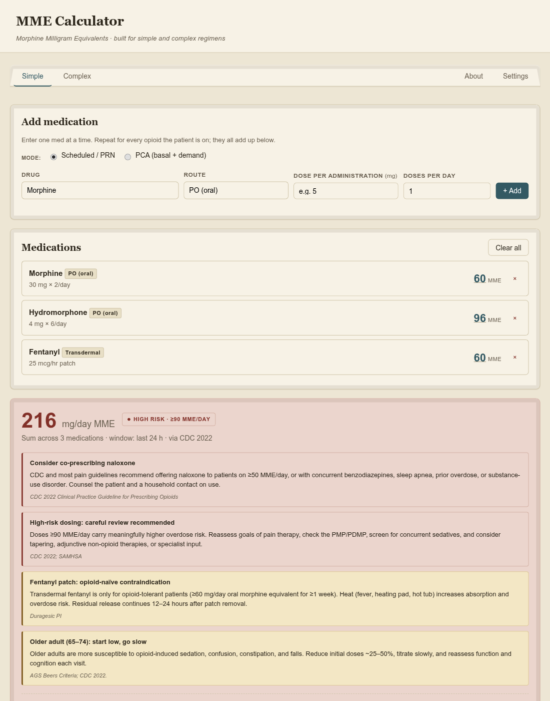

# MME Calculator

A single-page opioid Morphine Milligram Equivalent (MME) calculator. Total a
patient's daily MME from any mix of home medications, inpatient PRNs, IV
drips, PCAs, and pasted EHR administration records, then convert that total
to an equivalent dose of a different opioid with suggested scheduled and
breakthrough orders, safety alerts, a before/after comparison, and a taper
schedule.

Runs entirely in the browser. No backend. No build step. No data leaves the
device. Works as a regular website and as an installable PWA you can use
offline.



**Live version:** <https://robbie-med.github.io/Mme/>

---

## Who this is for

Clinicians (pain medicine, palliative care, anesthesia, hospital medicine,
primary care, addiction medicine) who need a fast, transparent scratch-pad
for opioid math at the point of care:

- "What's this patient's MME / day?"
- "I need to switch from morphine PO to hydromorphone PO, what dose?"
- "Help me write the actual order: scheduled plus breakthrough."
- "Plan a taper down to ≤50% of current."
- "What's my safety risk at this dose, and should I be co-prescribing naloxone?"

---

## Quick start

1. Open the app (or install it as a PWA).
2. **Simple view:** pick a drug, route, dose, doses-per-day → **+ Add**.
3. Repeat for every opioid the patient is on.
4. Read the running **MME / day** total and any safety alerts.
5. (Optional) Pick a **target opioid** plus cross-tolerance reduction to get
   an equivalent dose, finishable scheduled and breakthrough orders, a
   before/after comparison, and a taper plan.

For complex cases (inpatient PRNs, IV drips, parsed MAR data, patient
context), switch to **Complex view**.

---

## Features

### Two main views plus Settings

- **Simple:** streamlined cards for the everyday case. Add a med, see MME,
  convert if you want. No clutter.
- **Complex:** paste-MAR box, Patient Context panel, time-window controls
  (last 24 / 48 / 72 h or all-normalized-to-24h), the full breakdown table
  with calculation columns, and a references panel.
- **Settings:** default view on launch, persistence toggle, equianalgesic
  table picker (CDC 2022 / CMS 2017), install button, live
  online/offline cache status, and a confirm-gated Reset.

### Adding medications

- **Quick-add form** with smart unit hints. Fentanyl flips to mcg, the
  transdermal field becomes Patch rate (mcg/hr), methadone surfaces its
  tiered-factor note.
- **PCA mode:** toggle the Add form into a PCA layout for basal rate,
  demand dose, lockout, and avg demands/day. Effective daily dose is
  computed and contributes to the same MME total.
- **Paste MAR** (Complex view): drop in raw EHR text. The parser handles
  drug headers, brand names, tall-man lettering, multi-order blocks
  (`or`-prefixed and unprefixed strength changes), free-text PRN comments,
  and date / time / dose triplets.

### MME totals & risk awareness

- **Headline MME / day** updates live as you add or remove entries.
- **Risk badge:** Below 50, Caution (≥50, CDC 2022: pause and reassess,
  offer naloxone), High dosage (≥90, the 2016 guideline threshold), with the
  totals card tinted to match.
- **Safety alerts** below the total: naloxone co-prescription prompt,
  high-risk review prompt, methadone-specific cautions (QTc, steady state,
  specialist), meperidine, tramadol/codeine CYP2D6, fentanyl
  patch opioid-naïve contraindication. Each carries a citation pointer.
- **Patient context amplifications:** age band, renal CrCl band, and
  hepatic Child-Pugh band trigger additional alerts, and benzodiazepine /
  sleep-disordered breathing / overdose-or-SUD history checkboxes feed the
  CDC 2022 naloxone criteria. Context never changes the MME total; it does
  apply labeled maximum doses (e.g. tramadol) to suggested orders.

### Conversion to a target opioid

- Pick a target and a cross-tolerance reduction (default 50%). See
  **Conversion rules** below for the exact method per target.
- Every step is shown: current total, conversion basis, reduction, factor,
  calculated daily dose, and the ordered dose as a % of the calculation.
- **Suggested orders**: ER at its labeled interval (opioid-tolerant only),
  IR/parenteral at the shortest practical interval, all rounded down;
  methadone q8h from the label table; patch from the label table;
  breakthrough 10–20% of the daily dose. Labeled maximums are enforced.
- **Before/after comparison:** two-column current-vs-proposed view with
  each side's total and risk-tier badge plus a Δ from current. **Apply
  this regimen** swaps the ledger to the proposed primary entry in one
  click.
- **Taper-schedule generator:** stepwise reduction from the proposed
  regimen. Presets: 10% of the original dose per month (CDC 2022, ≥1 year
  of use), 10% of original per week then 10% of remaining (CDC 2022,
  shorter use), or 25% every 2 weeks (fastest labeled rate). Doses round
  down to givable amounts; patches use marketed strengths. Each row shows
  dose, MME, % of start and risk tier.

### Transparency

- Click any MME number to expand a step-by-step derivation: medication,
  doses in window (with timestamps for parsed entries), normalization step
  if span > 24 h, factor used, final MME, and a citation that names the
  active equianalgesic table.
- Click the headline total to see a per-medication breakdown that sums to
  the displayed value.

### Equianalgesic tables

A Settings dropdown switches between CDC 2022 (default) and CMS 2017
(graduated methadone). See **Equianalgesic factors** below.

### Share & export

- **Copy URL:** encodes the regimen, target, reduction, view, and any
  non-default table into the URL hash (via `history.replaceState`, so the
  back button stays clean). Opening the URL restores the full state.
- **Copy as note:** clean plaintext for a progress note. Current regimen,
  total with risk tier, target conversion plus scheduled and breakthrough
  orders, safety alerts with citations, table-name trailer, disclaimer.
- **Print:** a dedicated `@media print` stylesheet hides chrome,
  force-shows derivation panels, and strips colors.

### Persistence + PWA

- Settings, patient context, and the medication ledger persist via
  `localStorage` (toggleable). Reset wipes all three keys with a confirm.
- Web manifest + service worker precache the entire app shell. First
  visit caches it; subsequent loads are served from cache and updated in
  the background. On Chromium browsers, an install button appears once
  `beforeinstallprompt` fires.

---

## How it works

### Architecture

Frontend-only. ES modules under `js/`, loaded as `<script type="module">`.
No bundler; all imports resolve in the browser. `localStorage` for
persistence; a service worker for offline caching. The medication
**ledger** is the single source of truth, and a small subscribe/notify
pattern keeps render + hash sync in step without circular imports.

```
Ledger mutation (addManualEntry / addPCAEntry / addParsedOrders /
                 removeEntry / clearAll)
        │
        ▼
   notify() ────► syncHash() (URL hash)
        │
        └──────► render() (DOM)
                     │
                     ├─► mme.js          (computeEntryMME per row)
                     ├─► safety.js       (risk tier + alerts)
                     ├─► conversion.js   (target dose + orders + before/after)
                     └─► taper.js        (taper schedule when conversion picked)
```

### Per-entry MME math

For each entry, `computeEntryMME`:

1. Typed-in regimens are already daily amounts. Charted doses are filtered
   to the window and scaled to 24 h (see **Time windows**).
2. Each dose is converted to the drug's unit (g / mg / mcg).
3. Patches use the most recent application's rate if within 72 h.
4. Look up the factor (or range) from the active table; methadone uses
   the table's methadone rule on the daily oral-equivalent dose.
5. MME = daily dose × factor (upper value); the lower value is kept as the
   conversion basis.

### URL hash format

```
#m=morphine|PO|30|1;oxycodone|PO|5|4&t=hydromorphone|PO&rx=50&v=complex&tbl=cms
```

- `m=`: medications as `drug|route|dose|perDay`, semicolon-separated.
- `t=`: target opioid as `drug|route`.
- `rx=`: cross-tolerance reduction percent.
- `v=`: current view (omitted when equal to the user's default).
- `tbl=`: active equianalgesic table (omitted at the default, CDC).

---

## Equianalgesic factors

Every factor is traceable to a published source (see **Sources** below).
Two tables ship; the default is **CDC 2022**. They differ only where the
sources differ:

| Drug | CDC 2022 | CMS 2017 |
|---|---|---|
| Hydromorphone PO | 5 | 4 |
| Tramadol PO | 0.2 | 0.1 |
| Methadone PO | 4.7 (single factor) | 4 (≤20 mg/day), 8 (>20–40), 10 (>40–60), 12 (>60) |

Shared entries (MME per mg unless noted):

| Drug | Route | Factor | Source |
|---|---|---|---|
| Morphine | PO | 1 | CDC 2022 |
| Oxycodone | PO | 1.5 | CDC 2022 |
| Oxymorphone | PO | 3 | CDC 2022 |
| Hydrocodone | PO | 1 | CDC 2022 |
| Codeine | PO | 0.15 | CDC 2022 |
| Tapentadol | PO | 0.4 | CDC 2022 |
| Fentanyl | Transdermal (per mcg/hr) | 2.4 | CDC 2022 |
| Fentanyl | Buccal / SL / lozenge (per mcg) | 0.13 | CMS 2017 |
| Meperidine | PO | 0.1 | CMS 2017 |
| Levorphanol | PO | 11 | CMS 2017 |
| Butorphanol | Nasal spray | 7 | CMS 2017 |
| Buprenorphine | any | not counted | CDC 2022 footnote 6 |
| Morphine | IV / IM / SC | 2–3 | UofT chart: 10 mg parenteral = 20–30 mg oral |
| Hydromorphone | IV / IM / SC | 13.3–20 | UofT: 1.5 mg ≈ 10 mg parenteral morphine |
| Meperidine | IV / IM / SC | 0.27–0.4 | UofT: 75 mg ≈ 10 mg parenteral morphine |
| Codeine | IM / SC (not IV) | 0.17–0.25 | UofT: 120 mg ≈ 10 mg parenteral morphine |
| Fentanyl | IV / IM / SC (per mcg) | 0.1–0.3 | UofT (100 mcg ≈ 10 mg IV morphine) and CMS footnote vii (1 mg ≈ 100 mg oral morphine) |
| Nalbuphine | IV / IM / SC | 2–3 | Label: mg-for-mg with morphine |
| Methadone | IV | oral factor applied to 2 × IV mg | Methadone label: parenteral:oral 1:2 |

**Ranges.** Where sources disagree, the MME **total** uses the upper value
and **conversions** use the lower value for the current opioids and the
upper value for the target, so a suggested dose errs low.

The GlobalRPh and ASCO tables from earlier versions were removed because
their values could not be traced to a published source. Old links with
`tbl=globalrph` or `tbl=asco` fall back to CDC 2022.

## Conversion rules

- **Most targets:** conversion basis MME × (1 − cross-tolerance reduction,
  default 50%) ÷ the target's factor. CDC 2022 Table footnote 3: the new
  opioid is dosed "substantially lower than the calculated MME dose." The
  Dilaudid injection and hydromorphone ER labels use 50%.
- **Methadone target:** FDA methadone label Table 1 (percent of oral MED:
  <100 mg 20–30%, 100–300 mg 10–20%, 300–600 mg 8–12%, 600–1,000 mg 5–10%,
  >1,000 mg <5%). The low end is used, held monotonic across band edges, and
  capped at 30 mg/day (APS 2014: start no higher than 30–40 mg/day). No extra
  cross-tolerance reduction.
- **Fentanyl patch target:** FDA patch label Table 2 (60–134 mg/day → 25
  mcg/hr, then +25 mcg/hr per 90 mg/day up to 1,124). Blocked below 60
  MME/day (opioid-tolerant only) and above the table.
- **Converting from methadone:** orders are not generated (the label says
  its table cannot be used in reverse).
- **Rounding:** every dose is rounded **down** to a marketed strength;
  IR/parenteral doses pick the shortest interval (q4h, q6h, q8h) that still
  meets the smallest practical dose. ER products use their labeled interval
  (hydromorphone ER, hydrocodone ER, tramadol ER once daily; morphine,
  oxycodone, oxymorphone, tapentadol ER q12h) and are suggested only at
  ≥60 MME/day.
- **Labeled maximums:** tramadol 400 mg/day (300 over age 75; 200 with CrCl
  <30), tramadol ER 300, tapentadol 600 (ER 500), codeine 360. Orders are
  capped and a warning is shown.
- **Breakthrough:** 10–20% of the total daily dose (Myers & Shetty 2008).

## Time windows

- Typed-in regimens (manual, PCA, shared link) are daily amounts and are
  never filtered by the window.
- Charted MAR doses: window is (anchor − N h, anchor]; the sum is scaled by
  24 / N. "All shown" divides by the observed span (first → last dose plus
  one median interval, minimum 24 h).
- The "latest dose" anchor uses only charted doses.
- A patch counts at its rate for 72 h after its most recent application.
- Doses charted in g, mg or mcg are converted to the drug's unit per dose.

## Sources

Every factor and rule traces to one of these (links checked 2026-09-26).
The same list, with links, is in the app's About pane and in `js/refs.js`.

- Dowell D, et al. [CDC Clinical Practice Guideline for Prescribing Opioids
  for Pain — United States, 2022](https://www.cdc.gov/mmwr/volumes/71/rr/rr7103a1.htm).
  MMWR Recomm Rep 2022;71(RR-3). Table; Recommendations 3, 4, 5, 8, 11.
  ([PubMed Central copy](https://pmc.ncbi.nlm.nih.gov/articles/PMC9639433/))
- CMS. [Opioid Oral Morphine Milligram Equivalent (MME) Conversion
  Factors](https://www.hhs.gov/guidance/document/opioid-oral-morphine-milligram-equivalent-mme-conversion-factors-0)
  (CDC compilation, 2017 version; HHS Guidance Portal).
  ([PDF of the table, Utah Medicaid copy](https://medicaid-documents.dhhs.utah.gov/Documents/files/Opioid-Morphine-EQ-Conversion-Factors.pdf))
- University of Toronto, Department of Surgery. [Opioid Equianalgesic
  Table](https://surgery.utoronto.ca/sites/default/files/Opioid%20Equianalgesic%20Chart%20Nov%202014.pdf)
  (Nov 2014). Parenteral equivalences.
- Chou R, et al. [Methadone safety: a clinical practice guideline from the
  American Pain Society](https://pubmed.ncbi.nlm.nih.gov/24685458/). J Pain
  2014;15(4):321–37. [doi:10.1016/j.jpain.2014.01.494](https://doi.org/10.1016/j.jpain.2014.01.494)
- Myers J, Shetty N. [Going beyond efficacy: strategies for cancer pain
  management](https://pmc.ncbi.nlm.nih.gov/articles/PMC2216422/). Curr Oncol
  2008;15(Suppl 1):S41–S49. Breakthrough dose 10–20%.

FDA prescribing information (DailyMed):

- [Fentanyl transdermal system](https://dailymed.nlm.nih.gov/dailymed/drugInfo.cfm?setid=e15a7e9b-8025-49dd-9a6d-bafcccf1959f): opioid tolerance, patch conversion Table 2, strengths, wear time, taper
- [Methadone HCl tablets](https://dailymed.nlm.nih.gov/dailymed/drugInfo.cfm?setid=eddf7077-02fb-4771-9823-31984f4ff2bb): conversion Table 1, IV:PO 1:2, titration
- [Dilaudid (hydromorphone) injection](https://dailymed.nlm.nih.gov/dailymed/drugInfo.cfm?setid=9eebd88a-5632-460f-b7b6-26c8a180540d): 50% reduction, IV starting doses, organ impairment
- [Hydromorphone HCl ER tablets](https://dailymed.nlm.nih.gov/dailymed/drugInfo.cfm?setid=780a2616-0392-4715-bc50-71799bea1957): once daily, strengths, conversion from patch
- [OxyContin](https://dailymed.nlm.nih.gov/dailymed/drugInfo.cfm?setid=bfdfe235-d717-4855-a3c8-a13d26dadede): q12h, strengths
- [Morphine sulfate ER tablets](https://dailymed.nlm.nih.gov/dailymed/drugInfo.cfm?setid=533034fd-c8e7-495b-8874-0db41bd1e65a): q8–12h, strengths
- [Hysingla ER](https://dailymed.nlm.nih.gov/dailymed/drugInfo.cfm?setid=b7d23ac2-e776-9f62-3290-c64c2d6eb353): once daily, strengths
- [Oxymorphone HCl ER tablets](https://dailymed.nlm.nih.gov/dailymed/drugInfo.cfm?setid=3f4e703a-e398-42fd-8759-e398c79955f1): q12h, strengths
- [Nucynta](https://dailymed.nlm.nih.gov/dailymed/drugInfo.cfm?setid=80938c30-9fe3-4c7d-9d9c-5476638cfb2d): 600 mg/day maximum, hepatic impairment
- [Nucynta ER](https://dailymed.nlm.nih.gov/dailymed/drugInfo.cfm?setid=c3d04d70-0155-4147-9ce4-a3b1fad4b373): q12h, 500 mg/day maximum
- [Tramadol HCl tablets](https://dailymed.nlm.nih.gov/dailymed/drugInfo.cfm?setid=8ec4e4e5-a56e-4198-8428-6b770b9bf27d): 400 / 300 / 200 mg/day maximums
- [Tramadol HCl ER capsules](https://dailymed.nlm.nih.gov/dailymed/drugInfo.cfm?setid=c0bc7218-3fd0-4646-96f4-25355fc84aa9): once daily, 300 mg/day, renal/hepatic
- [Codeine sulfate tablets](https://dailymed.nlm.nih.gov/dailymed/drugInfo.cfm?setid=5819bdf7-300e-45b8-8f3a-447b53656293): 360 mg/day maximum, strengths
- [Nalbuphine HCl injection](https://dailymed.nlm.nih.gov/dailymed/drugInfo.cfm?setid=a99fe500-f52b-483c-807c-178f1a78a02b): potency vs morphine, withdrawal
- [Butorphanol tartrate nasal spray](https://dailymed.nlm.nih.gov/dailymed/drugInfo.cfm?setid=b8e48063-0b40-ee43-85c1-4ef2de80c404): withdrawal with full agonists
- [Hydrocodone bitartrate and acetaminophen](https://dailymed.nlm.nih.gov/dailymed/drugInfo.cfm?setid=995a6cc7-8b72-4d35-b3b4-8c5752438fb7): acetaminophen 4,000 mg/day

## Tests

```bash
npm test        # node --test tests/*.test.mjs, no dependencies
```

---

## Running locally

```bash
python3 -m http.server 8080
# then visit http://localhost:8080
```

Opening `index.html` directly via `file://` will work for most features,
but the service worker requires HTTP(S), so for PWA testing use the
local server.

## Hosting on GitHub Pages

1. Push to `main`.
2. **Settings → Pages → Source: Deploy from a branch → main / (root).**
3. GitHub publishes to `https://<user>.github.io/<repo>/` within a minute.

No build step. All assets sit at the repo root (or under `js/`) with
relative paths.

---

## Files

```
index.html                  UI structure
styles.css                  styling (incl. @media print)
service-worker.js           cache-first PWA service worker
manifest.webmanifest        PWA manifest
icon-*.png                  192 / 512 / maskable / iOS / favicon icons
README.md                   this file

js/                         ES-module sources (no bundler)
├── main.js                 entry point, init, event wiring
├── drugs.js                drug catalog + aliases + route labels
├── tables.js               CDC 2022 / CMS 2017 factor tables + sources
├── settings.js             settings + patient context + localStorage
├── ledger.js               ledger array, mutations, persistence, subscribe
├── mar-parser.js           EHR-paste parser
├── mme.js                  computeEntryMME, formatters, previewMME
├── safety.js               risk tiers + alerts + context amplifications
├── conversion.js           target dose, suggested orders, before/after
├── taper.js                taper-schedule generator
├── render.js               all DOM rendering + derivation panels
├── views.js                view state + tab switching
├── form.js                 quick-add form + PCA mode + context wiring
├── share.js                URL hash + copy URL / note + print
├── pwa.js                  install prompt + offline status
└── util.js                 escapeHtml
```

---

## Disclaimer

Published equianalgesic ratios are estimates and individual responses
vary substantially. Methadone conversions in opioid-tolerant patients
should involve a pain or palliative-care specialist; consider baseline
and follow-up ECGs for QTc monitoring. Account for residual fentanyl
release for 12–24 hours after patch removal and for any long-acting
formulations still in the patient's system. Use additional caution in
older adults and in renal, hepatic, or pulmonary disease.

**This tool is not a substitute for clinical judgement.** It does not
replace evaluation of pain control, function, withdrawal symptoms,
opioid use disorder risk, or relevant guideline review. Patient-specific
factors not modeled here (drug–drug interactions, genetic CYP variation,
concomitant sedatives, pregnancy, prior opioid exposure pattern) may
make the suggested doses inappropriate.
